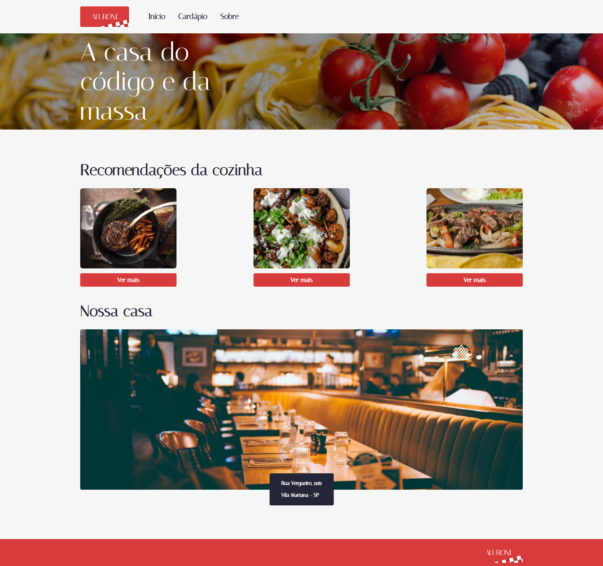

<h1 align="center">Alura-Aluroni</h1>

:book: Projeto criado durante o curso de React: lidando com arquivos estáticos da Alura


<div align="center">
  
</div>

## 📁 Acesso

É possivel baixar o projeto nesse <a href="https://github.com/lucash-barbosa/Alura-Aluroni/archive/refs/heads/master.zip">link</a>
ou <a href="https://alura-aluroni.vercel.app">acessar pelo navegador</a>

## 🛠️ Abrir e rodar o projeto

```bash
npm install
npm start

# Abra o programa no navegador pelo link http://localhost:3000/
```
